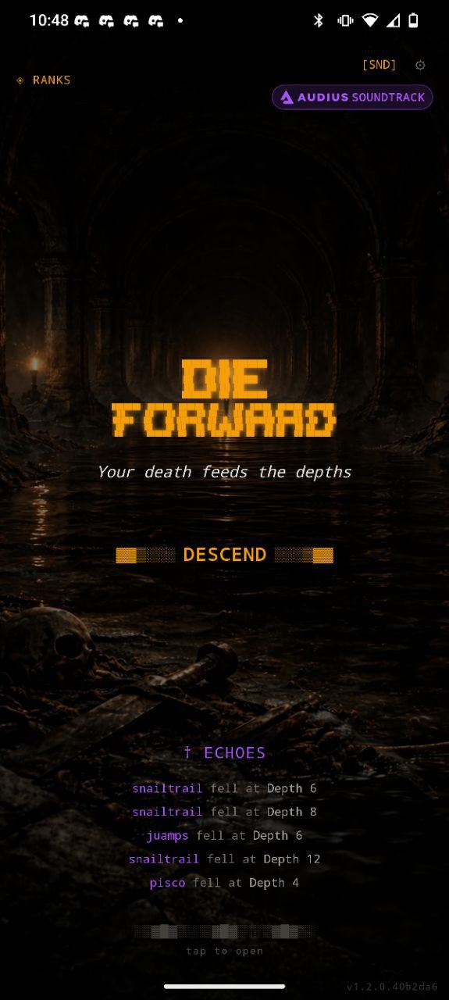
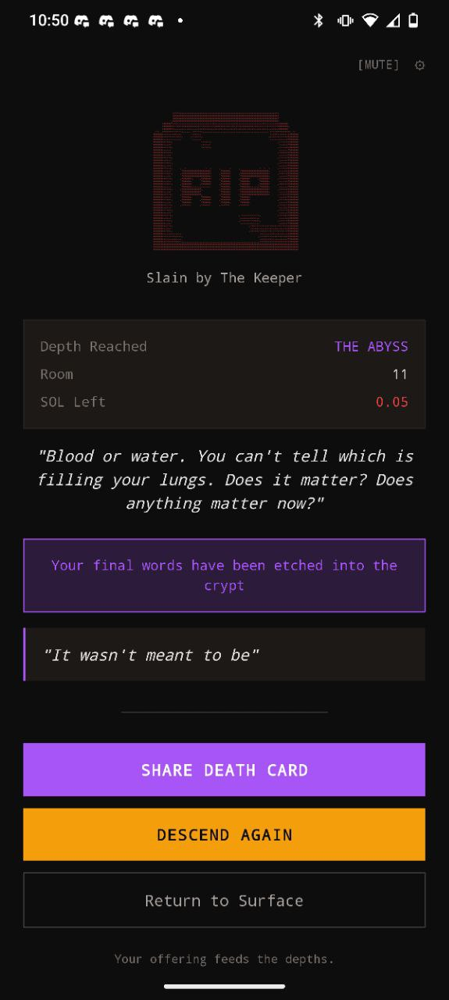
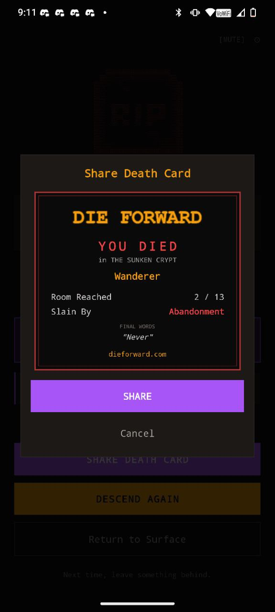
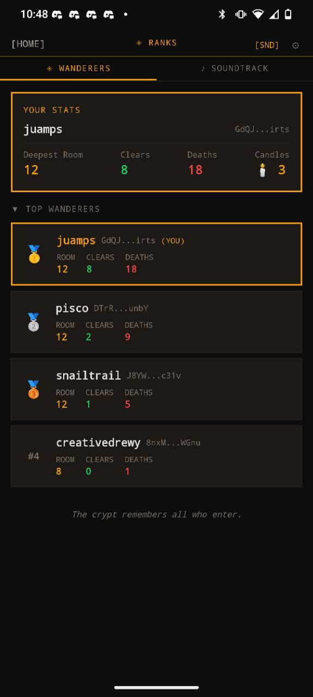
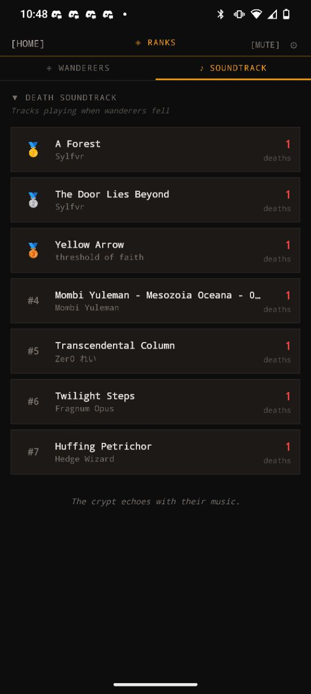

<p align="center">
  <pre>
 ██████╗ ██╗███████╗    ███████╗ ██████╗ ██████╗ ██╗    ██╗ █████╗ ██████╗ ██████╗ 
 ██╔══██╗██║██╔════╝    ██╔════╝██╔═══██╗██╔══██╗██║    ██║██╔══██╗██╔══██╗██╔══██╗
 ██║  ██║██║█████╗      █████╗  ██║   ██║██████╔╝██║ █╗ ██║███████║██████╔╝██║  ██║
 ██║  ██║██║██╔══╝      ██╔══╝  ██║   ██║██╔══██╗██║███╗██║██╔══██║██╔══██╗██║  ██║
 ██████╔╝██║███████╗    ██║     ╚██████╔╝██║  ██║╚███╔███╔╝██║  ██║██║  ██║██████╔╝
 ╚═════╝ ╚═╝╚══════╝    ╚═╝      ╚═════╝ ╚═╝  ╚═╝ ╚══╝╚══╝ ╚═╝  ╚═╝╚═╝  ╚═╝╚═════╝ 
  </pre>
</p>

<h3 align="center">💀 Your death feeds the depths 💀</h3>

<p align="center">
  <strong>A social roguelite on Solana where every death matters.</strong>
</p>

<p align="center">
  
  
  
  
</p>

---

<p align="center">
  <a href="https://dieforward.com">🎮 Play Now</a> •
  <a href="https://dieforward.com/graveyard-slides">📊 Pitch Deck</a> •
  <a href="#how-it-works">How It Works</a> •
  <a href="#integrations">Integrations</a> •
  <a href="#roadmap">Roadmap</a> •
  <a href="#tech-stack">Tech Stack</a>
</p>

---

## 🎯 The Concept

**Die Forward** reimagines death in gaming. In most games, dying means failure and frustration. Here, **death is a gift to future players**.

When you die:
- Your **corpse persists** in the dungeon
- Your **final words** become someone else's discovery  
- Your **staked SOL** joins the Memorial Pool
- Your **run record** is written on-chain via MagicBlock

*Lonely but not alone. Shared suffering, shared rewards.*

---

## 📸 Screenshots

<p align="center">
  
  
  
</p>
<p align="center">
  
  
  
</p>
<p align="center">
  
</p>

---

## 🎮 How It Works

```
┌─────────────┐   ┌─────────────┐   ┌─────────────┐   ┌─────────────┐
│   CONNECT   │ → │    STAKE    │ → │    PLAY     │ → │  DIE / WIN  │
│   Wallet    │   │  0.01+ SOL  │   │  Navigate   │   │             │
└─────────────┘   └─────────────┘   └─────────────┘   └─────────────┘
                                                              │
                         ┌────────────────────────────────────┴─────┐
                         ▼                                          ▼
                   ┌───────────┐                              ┌───────────┐
                   │   DEATH   │                              │  VICTORY  │
                   │           │                              │           │
                   │ • Corpse  │                              │ • Stake   │
                   │   persists│                              │   returned│
                   │ • Stake to│                              │ • +50%    │
                   │   pool    │                              │   bonus   │
                   │ • On-chain│                              │           │
                   │   record  │                              │           │
                   └───────────┘                              └───────────┘
```

### The Core Loop

1. **Connect** your Solana wallet (Phantom, Solflare, or Mobile Wallet Adapter)
2. **Stake** SOL to enter the dungeon (0.01 - 0.25 SOL)
3. **Navigate** procedurally generated rooms with narrative choices
4. **Fight** enemies using an intent-reading combat system
5. **Die** → Leave final words, become content for others
6. **...or Win** → Claim your stake + 50% bonus from the Memorial Pool

### Game Features

- **🏔️ Three Depths** — The dungeon gets harder as you descend
- **⚔️ Intent-Based Combat** — Read enemy telegraphs, exploit weaknesses
- **👁️ Boss Fight** — The Keeper awaits at Room 12
- **🎮 Free Play** — Try the game without connecting a wallet
- **⛓️ On-Chain Records** — Every run is recorded via MagicBlock ephemeral rollups
- **🎵 Decentralized Soundtrack** — Music streamed from Audius
- **📱 Mobile Native** — Full Mobile Wallet Adapter support

---

## 🔄 How Runs Are Tracked

Every run generates data at multiple layers. Here's what happens:

### Run Lifecycle

```
START                    PLAY                      END
┌──────────────┐    ┌──────────────┐    ┌─────────────────────────┐
│ • Session    │    │ • Room state │    │ DEATH:                  │
│   created    │ →  │   updated    │ →  │ • Death record saved    │
│ • Player     │    │ • Events     │    │ • Corpse spawned        │
│   record     │    │   logged     │    │ • Player stats updated  │
│ • ER run*    │    │ • ER room*   │    │ • ER committed*         │
└──────────────┘    └──────────────┘    │                         │
                                        │ VICTORY:                │
                                        │ • Payout processed      │
                                        │ • Player stats updated  │
                                        │ • ER committed*         │
                                        └─────────────────────────┘
                                        
* Only for staked runs with wallet connected
```

### Data Storage

| Data | Location | Retention |
|------|----------|-----------|
| **Sessions** | InstantDB | All runs |
| **Deaths & Corpses** | InstantDB | All runs |
| **Player Stats** | InstantDB | All players (guest + wallet) |
| **Run Records** | Solana (via MagicBlock) | Staked wallet runs only |
| **Social Posts** | Tapestry | Wallet users only |

### Run Types

| Type | Stake | On-Chain | Use Case |
|------|-------|----------|----------|
| **Staked Run** | 0.01-0.25 SOL | ✅ Full ER lifecycle | Core gameplay, leaderboards |
| **Empty-Handed** | 0 | ❌ InstantDB only | Practice, wallet users trying it out |
| **Guest Run** | 0 | ❌ InstantDB only | Onboarding, no wallet needed |

All run types:
- Create corpses for other players to discover
- Appear in the death feed
- Track player stats (deaths, highest room)

Staked runs additionally:
- Record on-chain via MagicBlock ephemeral rollups
- Contribute to/draw from the Memorial Pool
- Eligible for victory payouts (+50% bonus)

See [MAGICBLOCK.md](docs/MAGICBLOCK.md) for technical details on ephemeral rollups.

---

## ⚡ Integrations

Die Forward is built on cutting-edge Solana infrastructure:

### MagicBlock — Real-Time On-Chain Gameplay

Game logic runs on **ephemeral rollups** powered by [MagicBlock](https://magicblock.gg), enabling:
- **<50ms transactions** — No waiting for block confirmations
- **100% on-chain logic** — Game state lives on the rollup
- **Gasless gameplay** — Players don't pay per action
- **Automatic settlement** — Final state settles to Solana mainnet

```
Mobile Client → Ephemeral Rollup (MagicBlock) → Solana
                    Game state lives here
```

### Audius — Decentralized Soundtrack

Music is streamed directly from [Audius](https://audius.co):
- **Dungeon Synth & Gaming Arena** playlists
- **Death Soundtrack Leaderboard** — When you die, your track gets upvoted
- **Community-driven vibe** — The crypt's music is shaped by the fallen

### Tapestry — Social Layer

Player profiles and social features powered by [Tapestry](https://usetapestry.dev):
- **On-chain identity** — Your profile lives on Tapestry's social graph
- **Achievement tracking** — Run history and stats
- **Social discovery** — Follow other players, compete with friends

---

## ⚔️ Combat System

No HP trading ping-pong. Every choice is a **risk/reward tradeoff**. Read enemy intent, exploit weaknesses, gear up.

### Intent System
Enemy intent **matters**:
| Intent | Effect |
|--------|--------|
| AGGRESSIVE | Normal attack |
| CHARGING | Low now, **DOUBLE next turn** |
| DEFENSIVE | Reduced damage both ways |
| STALKING | Harder to flee |
| HUNTING | Bonus damage |

### Actions
- **⚔️ Strike** — Trade blows
- **🛡️ Brace** — Tank hit, negates charge
- **💨 Dodge** — Avoid damage, negates charge
- **🏃 Flee** — Try to escape

---

## 🤖 Agent API

Die Forward exposes a full API so **AI agents can play the game**. Agent deaths appear in the live feed alongside human deaths.

### Quick Start

```bash
# Read the skill file
curl https://dieforward.com/skill.md

# Start a game
curl -X POST https://dieforward.com/api/agent/start \
  -H "Content-Type: application/json" \
  -d '{"agentName": "my-agent"}'

# Take actions
curl -X POST https://dieforward.com/api/agent/action \
  -H "Content-Type: application/json" \
  -d '{"sessionId": "...", "action": "strike"}'
```

### API Endpoints

| Endpoint | Method | Description |
|----------|--------|-------------|
| `/skill.md` | GET | Skill file with full documentation |
| `/api/agent/start` | POST | Start a new game session |
| `/api/agent/action` | POST | Take an action (move, fight, etc.) |
| `/api/agent/state` | GET | Get current game state |

See [`/public/skill.md`](./public/skill.md) for complete API documentation.

---

## 🛠️ Tech Stack

| Layer | Technology | Purpose |
|-------|------------|---------|
| **Mobile App** | Expo SDK 54 + React Native | Cross-platform app (iOS, Android, Web) |
| **Smart Contract** | Anchor (Rust) | On-chain escrow for stakes |
| **Ephemeral Rollups** | MagicBlock | Real-time on-chain game logic |
| **Wallet** | Mobile Wallet Adapter | Native mobile wallet support |
| **Music** | Audius SDK | Decentralized soundtrack streaming |
| **Social** | Tapestry | Player profiles and social graph |
| **Database** | InstantDB | Real-time death feed, corpse persistence |
| **Web** | Next.js | Landing page and web version |
| **Deploy** | Vercel + Expo | Web hosting + mobile builds |
| **Network** | Solana Devnet | Blockchain transactions |

### On-Chain Programs

| Program | Address | Purpose |
|---------|---------|---------|
| **die_forward** (Escrow) | `34NSi8ShkixLt8Eg8XahXaRnaNuiFV63xdtC3ZfdTAt6` | Stake management |
| **run_record** (MagicBlock) | `9rGjguBZAnittA4Cbm7YNP5qomatY3c4MTV7LSqNomzS` | On-chain run records |

---

## 📱 Mobile Support

Die Forward is a **mobile-first** experience:

- **Expo SDK 54** with React Native
- **Mobile Wallet Adapter** for Phantom/Solflare on Android
- **Web version** at [dieforward.com](https://dieforward.com)
- **Android APK** available for direct install

---

## 🗺️ Roadmap

### Completed ✅

**Core Game**
- Roguelite dungeon crawler (3 depths, 12 rooms, boss fight)
- Intent-based combat system with 7 enemy intents
- Procedural room generation with narrative content
- Death persistence — corpses, final words, memorials

**On-Chain Infrastructure**
- SOL staking with on-chain escrow program (Anchor)
- MagicBlock ephemeral rollups for real-time game logic
- Run records written on-chain with automatic settlement
- Victory payouts (stake + 50% bonus from pool)

**Integrations**
- Audius decentralized soundtrack with death leaderboard
- Tapestry social profiles and achievement tracking
- Mobile Wallet Adapter for Phantom/Solflare

**Platform**
- Mobile-first Expo app (iOS, Android, Web)
- Agent API for AI players
- Android APK builds via GitHub releases

### Coming Soon 🚧

| Phase | Features |
|-------|----------|
| **Mainnet Launch** | Deploy to Solana mainnet, real stakes |
| **App Distribution** | Solana dApp Store, Google Play, iOS App Store |
| **Expanded Content** | New zones, enemies, items, boss variants |
| **Business Model** | Premium runs, cosmetics, seasonal content |

### Future 🔮

- **$DIE Token** — Earn tokens for notable deaths, spend on cosmetics
- **Guilds & Clans** — Team leaderboards, shared pools
- **Spectator Mode** — Watch runs in real-time
- **Run Replays** — Share your best (and worst) moments
- **PvP Zones** — Invade other players' runs

---

## 🚀 Setup

### Prerequisites

- Node.js 18+
- Solana wallet with devnet SOL
- (Optional) Android device with Phantom/Solflare for mobile testing

### Installation

```bash
# Clone the repo
git clone https://github.com/jpbedoya/die-forward.git
cd die-forward

# Install dependencies (mobile app)
cd mobile
npm install

# Run on web
npx expo start --web

# Run on Android
npx expo start --android
```

### Environment Variables

```bash
# InstantDB
NEXT_PUBLIC_INSTANT_APP_ID=your_app_id
INSTANT_ADMIN_KEY=your_admin_key

# Solana
NEXT_PUBLIC_SOLANA_RPC=https://api.devnet.solana.com
NEXT_PUBLIC_POOL_WALLET=your_pool_wallet_address
```

---

## 📁 Project Structure

```
die-forward/
├── mobile/                    # Expo app (main codebase)
│   ├── app/                   # App routes (Expo Router)
│   │   ├── (game)/           # Game screens
│   │   ├── index.tsx         # Home/title screen
│   │   └── _layout.tsx       # Root layout
│   ├── components/           # Shared components
│   ├── lib/                  # Utilities, game logic
│   ├── src/
│   │   ├── idl/              # Anchor IDLs
│   │   └── hooks/            # React hooks
│   ├── android/              # Android native code
│   └── app.config.js         # Expo config
├── anchor-programs/          # On-chain programs (Rust/Anchor)
│   ├── die_forward/          # Escrow program
│   └── run_record/           # MagicBlock run records
├── public/                   # Static assets + slides
│   └── graveyard-slides/     # Pitch deck
└── docs/                     # Documentation
```

---

## 📚 Documentation

| Doc | Description |
|-----|-------------|
| [Game Design](docs/GAME_DESIGN.md) | Mechanics, combat, death system |
| [Content Bible](docs/CONTENT_BIBLE.md) | Voice, tone, lore, writing guidelines |
| [Staking Flows](docs/STAKING_FLOWS.md) | On-chain escrow vs pool wallet flows |
| [Mobile Wallet](docs/MOBILE_WALLET.md) | MWA integration details |
| [Agent Skill](/public/skill.md) | API docs for agent players |

---

## 📄 License

All Rights Reserved © 2026

---

<p align="center">
  <strong>💀 Every death matters. 💀</strong>
</p>
