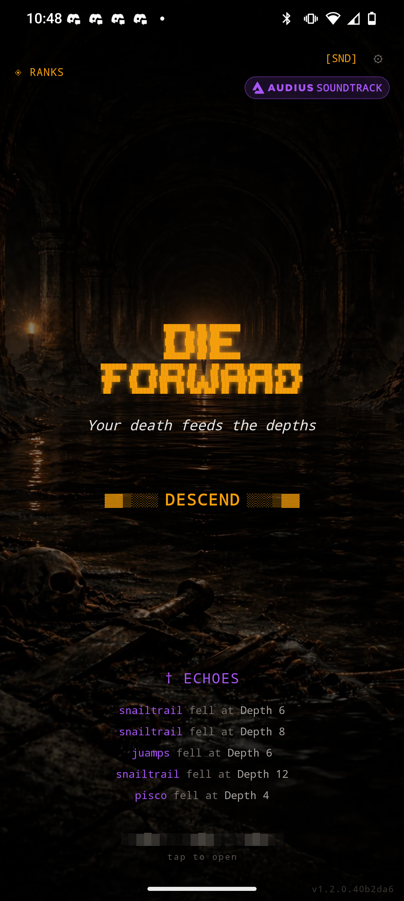
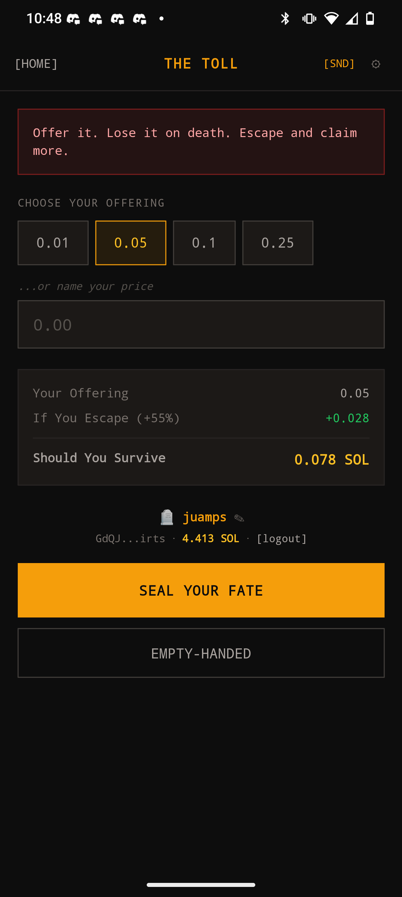
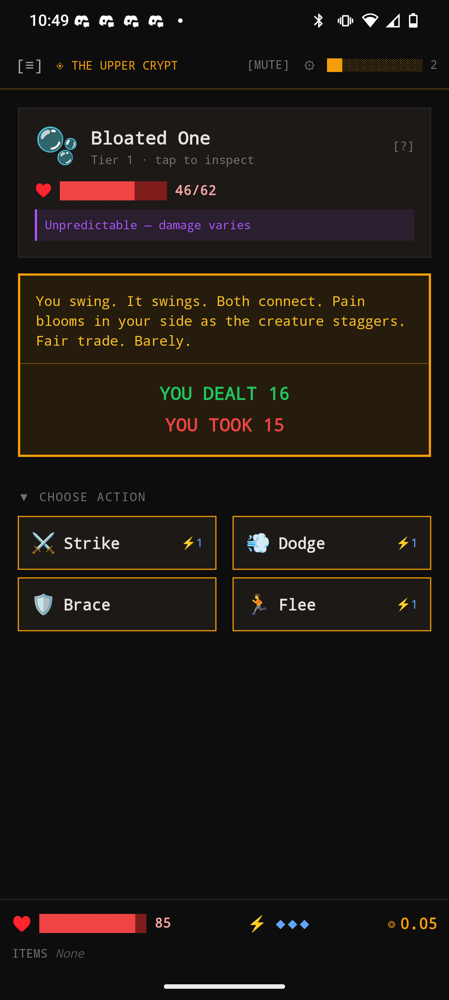
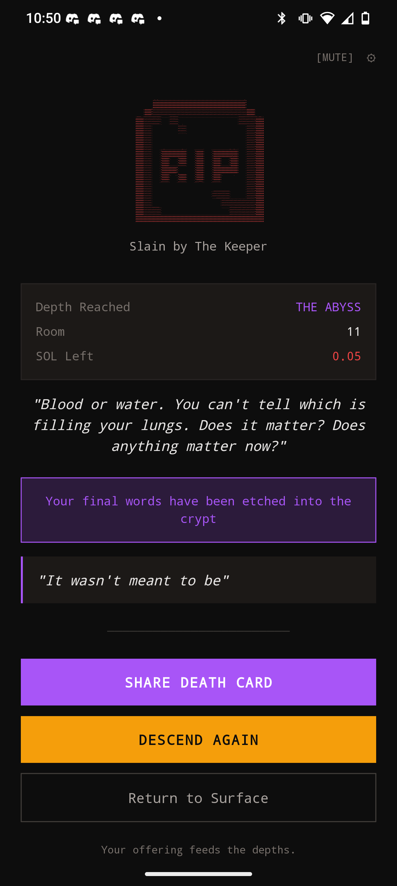
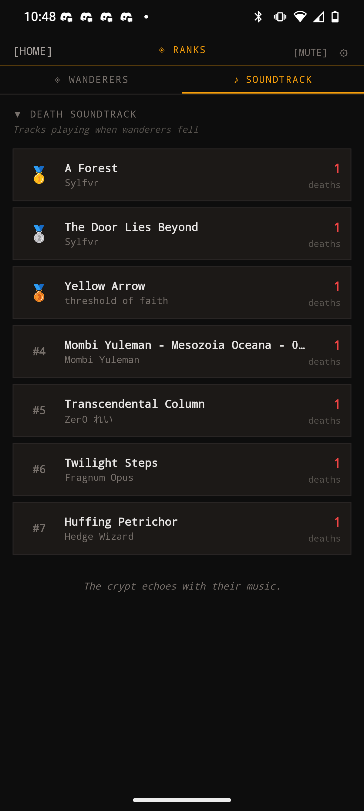
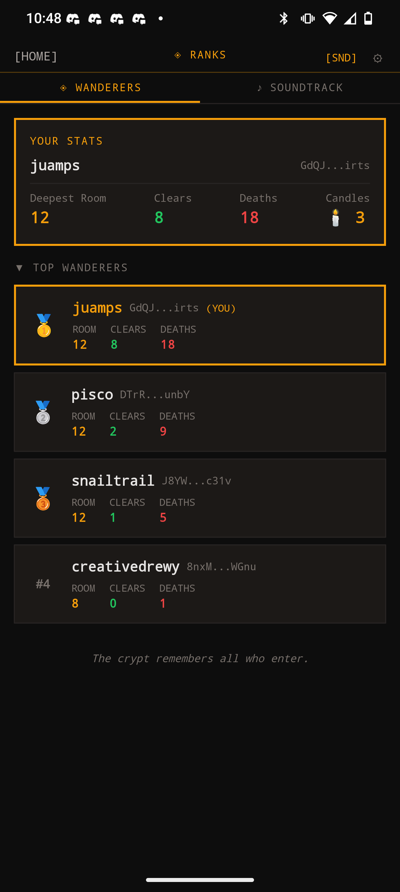
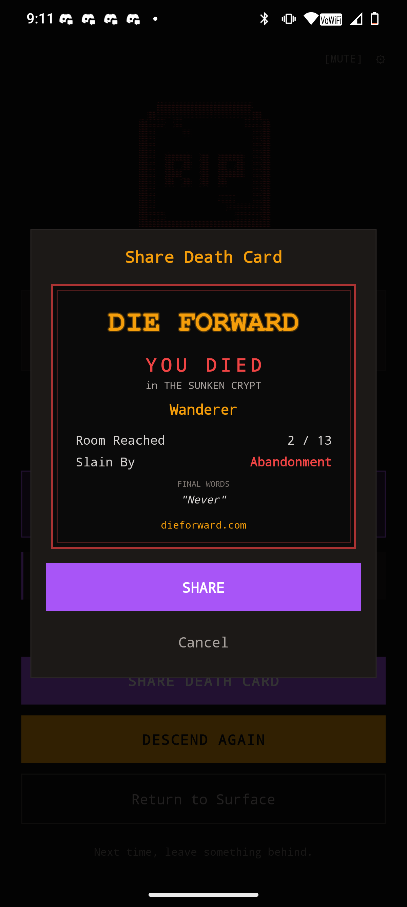

<p align="center">
  <pre>
 ██████╗ ██╗███████╗    ███████╗ ██████╗ ██████╗ ██╗    ██╗ █████╗ ██████╗ ██████╗ 
 ██╔══██╗██║██╔════╝    ██╔════╝██╔═══██╗██╔══██╗██║    ██║██╔══██╗██╔══██╗██╔══██╗
 ██║  ██║██║█████╗      █████╗  ██║   ██║██████╔╝██║ █╗ ██║███████║██████╔╝██║  ██║
 ██║  ██║██║██╔══╝      ██╔══╝  ██║   ██║██╔══██╗██║███╗██║██╔══██║██╔══██╗██║  ██║
 ██████╔╝██║███████╗    ██║     ╚██████╔╝██║  ██║╚███╔███╔╝██║  ██║██║  ██║██████╔╝
 ╚═════╝ ╚═╝╚══════╝    ╚═╝      ╚═════╝ ╚═╝  ╚═╝ ╚══╝╚══╝ ╚═╝  ╚═╝╚═╝  ╚═╝╚═════╝ 
  </pre>
</p>

<h3 align="center">💀 Your death feeds the depths 💀</h3>

<p align="center">
  <strong>A social roguelite on Solana where every death matters.</strong>
</p>

<p align="center">
  
  
  
  
</p>

---

<p align="center">
  <a href="https://dieforward.com">🎮 Play Now</a> •
  <a href="https://dieforward.com/graveyard-slides">📊 Pitch Deck</a> •
  <a href="#how-it-works">How It Works</a> •
  <a href="#integrations">Integrations</a> •
  <a href="#roadmap">Roadmap</a> •
  <a href="#tech-stack">Tech Stack</a>
</p>

---

## 🎯 The Concept

**Die Forward** reimagines death in gaming. In most games, dying means failure and frustration. Here, **death is a gift to future players**.

When you die:
- Your **corpse persists** in the dungeon
- Your **final words** become someone else's discovery — moderated and, if the death was notable, rebroadcast as an Echo Husk recital or inscribed on the Architect's walls
- Your **stake** (Pale Coins or staked SOL) joins the pool that funds other players' bonuses
- Your **run record** is written on-chain via MagicBlock (staked SOL runs) or as a signed InstantDB receipt (Coin-Bound runs)

*Lonely but not alone. Shared suffering, shared rewards.*

---

## 📸 Screenshots

<p align="center">
  
  
  
  
</p>
<p align="center">
  
  
  
</p>

---

## 🎮 How It Works

```
┌─────────────┐   ┌─────────────┐   ┌─────────────┐   ┌─────────────┐
│   CONNECT   │ → │    STAKE    │ → │    PLAY     │ → │  DIE / WIN  │
│   Wallet    │   │ Coins or SOL│   │  Navigate   │   │             │
└─────────────┘   └─────────────┘   └─────────────┘   └─────────────┘
                                                              │
                         ┌────────────────────────────────────┴─────┐
                         ▼                                          ▼
                   ┌───────────┐                              ┌───────────┐
                   │   DEATH   │                              │  VICTORY  │
                   │           │                              │           │
                   │ • Corpse  │                              │ • Stake   │
                   │   persists│                              │   returned│
                   │ • Stake to│                              │ • +50%    │
                   │   pool    │                              │   bonus   │
                   │ • On-chain│                              │           │
                   │   record  │                              │           │
                   └───────────┘                              └───────────┘
```

### The Core Loop

Die Forward runs on a three-rung **Offering Ladder**: play **Unbound** (free, no stake), stake earned-only **Pale Coins** to go **Coin-Bound** at the Toll, or — where enabled — stake **SOL** to go **Blood-Bound** on-chain.

1. **Connect** your Solana wallet (Phantom, Solflare, or Mobile Wallet Adapter) — or play as a guest
2. **Choose your rung**: free Unbound play, Coin-Bound (stake 60/120/240 Pale Coins), or Blood-Bound (stake 0.01-0.25 SOL, when the admin-controlled staking posture allows it)
3. **Roll your modifier** — each run gets one: Blood Pact, Glass Cannon, Iron Will, and more; a daily **world shift** can add its own modifier pool and mask map edges for the day
4. **Navigate** a branching dungeon graph (not a straight line — 20-23 nodes per zone with client-only side chambers); explore nodes give you real choices (advance safely, risk it for loot, or spend 1⚡ for an intel peek)
5. **Fight** enemies using an intent-reading combat system with 11 signature rules (rupture, reform, multiply, blink, absorb, drain, chant, pounce, honor, dormant, repeating) and a **Bait** verb that forces a one-shot crit window; the current community-elected **apex creature** hits harder and drops bonus loot; manage a 4-slot inventory with Common to Legendary items
6. **Die** → Leave final words (moderated before anyone sees them), become content for others; cross a death milestone to unlock titles and perks; a Coin-Bound death burns your stake into the pool and resets your Binding Streak
7. **...or Win** → Claim your stake back plus a pool-funded bonus, and — if Coin-Bound — extend your public Binding Streak toward its next seal tier

### Game Features

| Feature | Description |
|---------|-------------|
| **🪙 The Offering Ladder** | Three staking rungs: free Unbound play, Coin-Bound (earned-only Pale Coins, never purchasable), and Blood-Bound (on-chain SOL, gated by an admin `stakingPosture` setting) |
| **🔥 Binding Streak** | Consecutive Coin-Bound clears build a public seal tier; a Coin-Bound death resets the streak |
| **⚔️ Intent-Based Combat** | Read enemy telegraphs, exploit weaknesses — no HP trading ping-pong |
| **🩸 Signature Rules & Bait** | 11 creature signature rules (rupture, reform, multiply, blink, absorb, drain, chant, pounce, honor, dormant, repeating) plus a Bait verb that forces a one-shot crit window |
| **👑 Apex Creatures** | A community-elected apex per zone carries a +15% HP/damage buff and a bounty payout on kill |
| **🗺️ Branching Dungeons** | Each zone is a 20-23 node branching graph (not a straight line), with client-only side chambers revealed by Bone Dust — Sunken Crypt, Ashen Crypts, Frozen Gallery, Living Tomb, Void Beyond |
| **🌒 Daily World Shift** | A seeded daily shift changes each zone's modifier pool and masks map edges/side doors |
| **🕸️ Community Layer** | Nightly aggregation across all runs surfaces the apex creature, mass-death curse nodes, and a single deadliest Architect node per zone |
| **📯 Dispatches & Push** | A shared dispatch pipeline surfaces the day's threats on the home screen and zone select, with opt-in push notifications at your local morning |
| **🛡️ Moderated UGC** | Final words and other player-authored text are server-moderated (homoglyph/leet-aware filter, trust-weighted, report-suppressed) before they're rebroadcast |
| **🎲 Explore Choices** | Every explore node presents 2-3 options: safe advance, [RISK] loot gamble, or [1⚡] intel peek |
| **🔮 Run Modifiers** | Each run rolls a unique modifier (Blood Pact, Glass Cannon, Iron Will, and more), plus a shift-day modifier pool |
| **💀 Death Milestones** | 6 death thresholds unlock titles, cosmetics, items, and HP boosts |
| **🎒 Inventory Limit** | 4-item cap with rarity tiers (Common → Legendary) and a swap modal when full |
| **🌑 Legendary Items** | Death's Mantle (death save) and Voidblade (+50% dmg, -5 HP/turn) |
| **💀 Persistent Deaths** | Your corpse, final words, and loot persist for other players to discover |
| **🎴 Death Cards** | Share your death as a stylized card on social media |
| **💸 Corpse Tipping** | Tip SOL to fallen players whose corpses you find |
| **🏆 Leaderboards** | Compete on depth reached, total deaths, and earnings |
| **🎮 Free Play** | Try empty-handed (Unbound) without staking, including fully offline — deaths still count toward milestones |
| **⛓️ On-Chain Records** | Blood-Bound runs recorded via MagicBlock ephemeral rollups, with VRF-verified run seeds |
| **🎵 Decentralized Soundtrack** | Music streamed from Audius — your death track goes on the leaderboard |
| **🤖 Agent API** | AI agents can play via REST API — their deaths appear in the feed |
| **📱 Mobile Native** | Full Mobile Wallet Adapter support (Phantom, Solflare) |

---

## 🔄 How Runs Are Tracked

Every run generates data at multiple layers. Here's what happens:

### Run Lifecycle

```
START                    PLAY                      END
┌──────────────┐    ┌──────────────┐    ┌─────────────────────────┐
│ • Session    │    │ • Room state │    │ DEATH:                  │
│   created    │ →  │   updated    │ →  │ • Death record saved    │
│ • Player     │    │ • Events     │    │ • Corpse spawned        │
│   record     │    │   logged     │    │ • Player stats updated  │
│ • ER run*    │    │ • ER room*   │    │ • ER committed*         │
└──────────────┘    └──────────────┘    │                         │
                                        │ VICTORY:                │
                                        │ • Payout processed      │
                                        │ • Player stats updated  │
                                        │ • ER committed*         │
                                        └─────────────────────────┘
                                        
* Only for staked runs with wallet connected
```

### Data Storage

| Data | Location | Retention |
|------|----------|-----------|
| **Sessions** | InstantDB | All runs |
| **Deaths & Corpses** | InstantDB | All runs |
| **Player Stats** | InstantDB | All players (guest + wallet) |
| **Run Records** | Solana (via MagicBlock) | Staked wallet runs only |
| **Social Posts** | Tapestry | Wallet users only |

### Run Types

| Type | Stake | On-Chain | Use Case |
|------|-------|----------|----------|
| **Blood-Bound (Staked SOL)** | 0.01-0.25 SOL | ✅ Full ER lifecycle | Core gameplay, leaderboards (when `stakingPosture` allows) |
| **Coin-Bound** | 60/120/240 Pale Coins | ❌ InstantDB only (receipted) | Core gameplay, Binding Streak, no wallet needed |
| **Unbound / Empty-Handed** | 0 | ❌ InstantDB only | Practice, wallet users trying it out |
| **Guest Run** | 0 | ❌ InstantDB only, offline-capable | Onboarding, no wallet needed |

All run types:
- Create corpses for other players to discover
- Appear in the death feed
- Track player stats (deaths, highest room)
- Write a signed run receipt (`runReceipts`) capturing the run seed, day key, shift state, and chosen modifier

Blood-Bound runs additionally:
- Record on-chain via MagicBlock ephemeral rollups
- Eligible for victory payouts (+50% bonus) from the on-chain pool

Coin-Bound runs additionally:
- Draw from / contribute to the pool-funded `coinPool`
- Build (or reset) a public Binding Streak toward its next seal tier

See [MAGICBLOCK.md](docs/MAGICBLOCK.md) for technical details on ephemeral rollups.

---

## ⚡ Integrations

Die Forward is built on cutting-edge Solana infrastructure:

### MagicBlock — Real-Time On-Chain Gameplay

Game logic runs on **ephemeral rollups** powered by [MagicBlock](https://magicblock.gg), enabling:
- **<50ms transactions** — No waiting for block confirmations
- **100% on-chain logic** — Game state lives on the rollup
- **Gasless gameplay** — Players don't pay per action
- **Automatic settlement** — Final state settles to Solana mainnet
- **VRF randomness** — Provably fair game seeds via on-chain oracle (✅ deployed, see below)

```
Mobile Client → Ephemeral Rollup (MagicBlock) → Solana
                    ↓
              VRF Oracle (free on ER)
```

#### VRF Integration (✅ Deployed)

MagicBlock's VRF oracle provides **verifiable randomness** for game seeds:
- Runs free on the ephemeral rollup
- Seeds are committed to L1 with the run record
- Anyone can verify the randomness was fair
- Enable via admin panel: `enableMagicBlock` + `enableVRF`

See [`docs/MAGICBLOCK.md`](docs/MAGICBLOCK.md#vrf-integration) for implementation details.

### Audius — Decentralized Soundtrack

Music is streamed directly from [Audius](https://audius.co):
- **Dungeon Synth & Gaming Arena** playlists
- **Death Soundtrack Leaderboard** — When you die, your track gets upvoted
- **Community-driven vibe** — The crypt's music is shaped by the fallen

### Tapestry — Social Layer

Player profiles and social features powered by [Tapestry](https://usetapestry.dev):
- **On-chain identity** — Your profile lives on Tapestry's social graph
- **Achievement tracking** — Run history and stats
- **Social discovery** — Follow other players, compete with friends

---

## ⚔️ Combat System

No HP trading ping-pong. Every choice is a **risk/reward tradeoff**. Read enemy intent, exploit weaknesses, gear up. Each run's modifier changes the math.

### Intent System
Enemy intent **matters**:
| Intent | Effect |
|--------|--------|
| AGGRESSIVE | Normal attack |
| CHARGING | Low now, **DOUBLE next turn** |
| DEFENSIVE | Reduced damage both ways |
| STALKING | Harder to flee |
| HUNTING | Bonus damage |

### Actions
- **⚔️ Strike** — Trade blows (+50% vs AGGRESSIVE/HUNTING)
- **🛡️ Brace** — Tank hit, negates charge (Iron Will modifier: zero damage)
- **💨 Dodge** — Avoid damage, counter-attack on CHARGING
- **🩸 Bait** — Forces the enemy's next intent to AGGRESSIVE, opening a one-shot crit window (costs a resource set by `baitCost`)
- **🏃 Flee** — Try to escape (Bone Hook / Pale Coin boost odds)

### Signature Rules
Creatures carry one of 11 signature rules that change how a fight actually plays: rupture, reform, multiply, blink, absorb, drain, chant, pounce, honor, dormant, and repeating (an Echo Husk that recites a moderated line from a past run's final words). All 11 live in `creature-rules.ts`, wired against pure combat math in `combat-math.ts`.

### Apex Creatures
Each zone has a community-elected **apex creature** (the one racking up the most kills across all players that day) carrying a **+15% HP/damage buff**; killing it pays a bounty — a bonus loot roll plus bestiary-mastery credit.

### Run Modifiers
Each run rolls one modifier from six: 🩸 Blood Pact (+25% dmg, -30% healing), 🌑 Blind Descent (intent hidden turn 1), 💀 Death's Echo (+30% corpse chance), 🧊 Numbing Cold (+1 stamina regen/turn), 🛡️ Iron Will (Brace negates all damage), ⚡ Glass Cannon (60 HP start, +50% dmg) — plus a daily **world shift** that can swap in its own modifier pool for the zone.

---

## 🤖 Agent API

Die Forward exposes a full API so **AI agents can play the game**. Agent deaths appear in the live feed alongside human deaths.

### Quick Start

```bash
# Read the skill file
curl https://dieforward.com/skill.md

# Start a game
curl -X POST https://dieforward.com/api/agent/start \
  -H "Content-Type: application/json" \
  -d '{"agentName": "my-agent"}'

# Take actions
curl -X POST https://dieforward.com/api/agent/action \
  -H "Content-Type: application/json" \
  -d '{"sessionId": "...", "action": "strike"}'
```

### API Endpoints

| Endpoint | Method | Description |
|----------|--------|-------------|
| `/skill.md` | GET | Skill file with full documentation |
| `/api/agent/start` | POST | Start a new game session |
| `/api/agent/action` | POST | Take an action (move, fight, etc.) |
| `/api/agent/state` | GET | Get current game state |

See [`/public/skill.md`](./public/skill.md) for complete API documentation.

---

## 🛠️ Tech Stack

| Layer | Technology | Purpose |
|-------|------------|---------|
| **Mobile App** | Expo SDK 54 + React Native | Cross-platform app (iOS, Android, Web) |
| **Smart Contract** | Anchor (Rust) | On-chain escrow for stakes |
| **Ephemeral Rollups** | MagicBlock | Real-time on-chain game logic + VRF |
| **Wallet** | Mobile Wallet Adapter | Native mobile wallet support |
| **Music** | Audius SDK | Decentralized soundtrack streaming |
| **Social** | Tapestry | Player profiles and social graph |
| **Database** | InstantDB | Real-time death feed, corpse persistence |
| **Web** | Next.js | Landing page and web version |
| **Deploy** | Vercel + Expo | Web hosting + mobile builds |
| **Network** | Solana Devnet | Blockchain transactions |

### On-Chain Programs

| Program | Address | Purpose |
|---------|---------|---------|
| **die_forward** (Escrow) | `34NSi8ShkixLt8Eg8XahXaRnaNuiFV63xdtC3ZfdTAt6` | Stake management |
| **run_record** (MagicBlock) | `9rGjguBZAnittA4Cbm7YNP5qomatY3c4MTV7LSqNomzS` | On-chain run records |

---

## 📱 Mobile Support

Die Forward is a **mobile-first** experience:

- **Expo SDK 54** with React Native
- **Mobile Wallet Adapter** for Phantom/Solflare on Android
- **Web version** at [dieforward.com](https://dieforward.com)
- **Android APK** available for direct install

---

## 🗺️ Roadmap

### Completed ✅

**Phase 0 — Hackathon Prototype (Feb 2026)**
- Roguelite dungeon crawler (3 depths, 12 rooms, boss fight)
- Intent-based combat system with 7 enemy intents
- Death persistence — corpses, final words, memorials
- SOL staking with on-chain escrow (Anchor), MagicBlock ephemeral rollups
- Audius decentralized soundtrack, Tapestry social profiles
- Mobile Wallet Adapter for Phantom/Solflare
- Agent API for AI players; Android APK via GitHub releases

**Phase 1 — Content Engine + Progression (Mar 2026)**
- Zone system: 5 zones with unique creatures and bosses (zone-loader.ts powers dungeon generation)
- Explore room choices: primary / [RISK] / [1⚡] intel peek options
- Run modifiers: 6 unique per-run modifiers (Blood Pact, Glass Cannon, Iron Will, and more)
- Death milestones: 6 thresholds unlocking titles, cosmetics, items, and HP boosts
- Inventory limit: 4-slot cap with item swap modal
- Item rarity: Common / Uncommon / Rare / Legendary tiers with weighted drops
- Legendary items: Death's Mantle (death save) and Voidblade (+50% dmg, -5 HP/turn)
- Combat determinism: seeded RNG for creature HP and intent
- Healing centralized through applyHealing (Blood Pact applies consistently)

**Phase 2 — Branching Maps + Pale Coins (2a/2b)**
- All 5 zones converted to branching DAG dungeons (20-23 nodes each) with client-only, item-gated side chambers
- Pale Coins introduced: earned-only in-game currency (never purchasable) with concave depth income + clear bonuses
- Content bible and zone-aware creature/item generation via `zone-loader.ts`

**Phase 3 — The Offering Ladder (3a/3b)**
- Daily seeded world shift: per-zone modifier pool + masked map edges, admin-toggleable
- Coin-Bound staking at the Toll (60/120/240 Pale Coins), pool-funded escape bonus, Binding Streak with seal tiers
- `stakingPosture` setting to hide/ritualize/open Blood-Bound (SOL) staking independently of Coin-Bound

**Security Hardening**
- Server-verified InstantDB auth (`verifyAuthToken`) required for all money-affecting session/game routes
- Closed coin-mode IDOR on both client and server; admin routes gated by `verifyAuthToken` + admin allowlist; deny-by-default InstantDB perms

**Phase 4 — Community Layer, Dispatches & Moderation (4a/4b/4c)**
- Nightly aggregation surfaces a community-elected apex creature (+15% HP/dmg buff + bounty), mass-death curse nodes, and a deadliest Architect node per zone
- Shared dispatch pipeline (home panel + zone select) with opt-in push notifications sent at each player's local morning, capped to respect quiet days
- Server-authoritative UGC moderation (homoglyph/leet-aware filter, trust-weighted, report-suppressed) gates every rebroadcast of a player's final words — Echo Husk recitals and Architect wall inscriptions included
- 11 creature signature rules (rupture, reform, multiply, blink, absorb, drain, chant, pounce, honor, dormant, repeating) and the Bait combat verb

### Remaining — Launch Hardening 🚧

| Item | Status |
|------|--------|
| **Push notification credentials** | Pipeline built (`expo-server-sdk`); production credentials still needed |
| **iOS local build script** | Android has a local build path (`build:android:local`); no iOS equivalent yet — EAS/App Store distribution still pending |
| **`CRON_SECRET` in prod** | Cron routes (`/api/game/shift`, `/api/game/dispatch`, `session/cleanup`) run open-and-warn without it — must be set before mainnet |
| **Pre-mainnet security residuals** | Known non-money-affecting gaps: A5 wallet-sybil keying, missing ownership check on `players` writes — must close before real value is at stake |
| **Mainnet Launch** | Deploy to Solana mainnet, real stakes |

### Future 🔮

- **$DIE Token** — Earn tokens for notable deaths, spend on cosmetics
- **Guilds & Clans** — Team leaderboards, shared pools
- **Spectator Mode** — Watch runs in real-time
- **Run Replays** — Share your best (and worst) moments
- **PvP Zones** — Invade other players' runs

---

## 🚀 Setup

### Prerequisites

- Node.js 18+
- Solana wallet with devnet SOL
- (Optional) Android device with Phantom/Solflare for mobile testing

### Installation

```bash
# Clone the repo
git clone https://github.com/jpbedoya/die-forward.git
cd die-forward

# Install dependencies (mobile app)
cd mobile
npm install

# Run on web
npx expo start --web

# Run on Android
npx expo start --android
```

### Local Android Build (APK)

To build a standalone APK locally — not just the dev server:

```bash
cd mobile
npx expo prebuild --platform android --clean        # first time / when native config changes
npm run build:android:local                         # standalone debug APK (~78 MB)
npm run build:android:local -- --prod               # release APK (~40 MB, R8-minified, signed)
npm run build:android:local -- --prod --publish     # release + GitHub release at dev-<version>
```

Output lands in `mobile/dist/<name>-<version>[-release].apk`. See [`mobile/BUILD_NOTES.md`](mobile/BUILD_NOTES.md#local-android-build) for the one-time JDK + Android SDK toolchain setup and the release keystore.

### Environment Variables

```bash
# InstantDB
NEXT_PUBLIC_INSTANT_APP_ID=your_app_id
INSTANT_ADMIN_KEY=your_admin_key

# Solana
NEXT_PUBLIC_SOLANA_RPC=https://api.devnet.solana.com
NEXT_PUBLIC_POOL_WALLET=your_pool_wallet_address
```

---

## 📁 Project Structure

```
die-forward/
├── mobile/                    # Expo app (main codebase)
│   ├── app/                   # App routes (Expo Router)
│   │   ├── (game)/           # Game screens
│   │   ├── index.tsx         # Home/title screen
│   │   └── _layout.tsx       # Root layout
│   ├── components/           # Shared components
│   ├── lib/                  # Utilities, game logic
│   ├── src/
│   │   ├── idl/              # Anchor IDLs
│   │   └── hooks/            # React hooks
│   ├── android/              # Android native code
│   └── app.config.js         # Expo config
├── anchor-programs/          # On-chain programs (Rust/Anchor)
│   ├── die_forward/          # Escrow program
│   └── run_record/           # MagicBlock run records
├── public/                   # Static assets + slides
│   └── graveyard-slides/     # Pitch deck
└── docs/                     # Documentation
```

---

## 📚 Documentation

| Doc | Description |
|-----|-------------|
| [Game Design](docs/GAME_DESIGN.md) | Mechanics, combat, death system |
| [Content Bible](docs/CONTENT_BIBLE.md) | Voice, tone, lore, writing guidelines |
| [Staking Flows](docs/STAKING_FLOWS.md) | On-chain escrow vs pool wallet flows |
| [Mobile Wallet](docs/MOBILE_WALLET.md) | MWA integration details |
| [Agent Skill](/public/skill.md) | API docs for agent players |

---

## 📄 License

All Rights Reserved © 2026

---

<p align="center">
  <strong>💀 Every death matters. 💀</strong>
</p>
